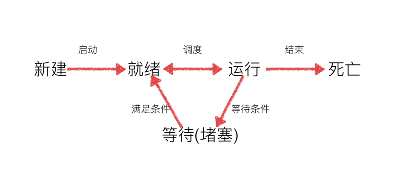

多任务：同一个时间段中，执行多个函数/运行多个程序.

操作系统可以同时运行多个任务:
操作系统轮流让各个任务交替执行，任务1执行0.01秒，切换到任务2，任务2执行0.01秒，再切换到任务3，执行0.01秒……这样反复执行下去。表面上看，每个任务都是交替执行的，但是，由于CPU的执行速度实在是太快了，感觉就像所有任务都在同时执行一样。(时间片轮转)

任务 执行算法：
- 时间片轮转
- 优先级调度
- 调度算法（什么样的情况下按照什么样的规则，让哪个任务执行）

真正的并行执行多任务只能在多核CPU上实现，但是，由于任务数量远远多于CPU的核心数量，所以，操作系统也会自动把很多任务轮流调度到每个核心上执行。

- 进程
- 线程
- 协程

并发：看上去一齐执行（任务数>内核数）
并行：真正一齐执行（内核数>任务数）

程序：编写完毕的代码，在没有运行的时候（一个可执行的代码，可以理解称没有生命）
进程：正在运行的代码（除了包含代码外，还需要运行环境，占用的内存，键盘，显示器等，可以理解称具有生命）

## 进程

> 创建子进程

`os.fork()`创建新的进程，为子进程

```
import os
import time

ret = os.fork() # 返回二个特殊值， 其中一个等于0（子进程），一个不固定的大于0的值（父进程，pid）。都是int类型。

if ret == 0:
while True:
print('1')
time.sleep(1)
else:
while True:
print('2')
time.sleep(1)
```

不一定父进程先执行，或子进程先执行，哪个进程先执行，是依靠操作系统调度算法。

Note: `os.fork()`，只在`Unix/Linux/Mac`上运行，`windows`不可以。

> getpid、getppid

```
import os

ret = os.fork()
print(ret)
if ret > 0:
print('父进程 - %d'%os.getpid())
else:
print('子进程 - %d - %d'%(os.getpid(), os.getppid()))

"""
1535
父进程 - 1534
0
子进程 - 1535 - 1534
"""
```

`os.getpid()`: 子进程的pid的值
`os.getppid()`: 父进程的pid的值

父进程中`fork`的返回值，就是刚刚创建出来的子进程的`pid`

> 父子进程的先后顺序

主进程执行完结束后，子进程没有结束。照样主进程结束掉，而子进程一样执行完程序。

```
import os
import time

ret = os.fork()

if ret == 0:
print('子进程')
time.sleep(5)
print('子进程over')
else:
print('父进程')
time.sleep(3)

print('over')
```
执行结果：
```
父进程
子进程
over
linxingzhangdeMacBook-Air:python linxingzhang$ 子进程over
over
光标定位到当前位置
```

> 全局变量在多个进程中不共享

```
import os
import time

g_num = 100

ret = os.fork()

if ret == 0:
g_num += 1
print('process-c - %d'%g_num)
else:
time.sleep(3)
print('process-p - %d'%g_num)
```
执行结果：
```
process-c - 101
process-p - 100
```
在进程中，全局变量，局部变量，在各自进程的命名空间中，互不干预。
进程和进程之间，数据无法共享。

同一台电脑进程之间通信：管道，消息队列...
不同一台电脑进程之间通信：网络


> 多个fork

第一种：多个`fork`情况，并列`fork`。
```
import os

# 父进程
ret = os.fork()

if ret == 0:
# 子进程
print('1')
else:
# 父进程
print('2')

# 父子进程
ret = os.fork()

if ret == 0:
# 孙子进程
# 2儿子进程
print('11')
else:
# 儿子进程
# 父进程
print('22')
```
执行结果：
```
2
22
1
11
11
22
```

第二种`fork`情况，包含`fork`
```
import os

# 父进程
ret = os.fork()

if ret == 0:
# 子进程
print('1')
else:
# 父进程
print('2')

ret = os.fork()

if ret == 0:
# 2儿子进程
print('11')
else:
# 父进程
print('22')
```
执行结果：
```
2
22
1
11
```

父子进程的执行顺序：
父进程、子进程执行顺序没有规律，完全取决于操作系统的**调度算法**

> Process创建子进程


`multiprocessing`模块是跨平台版本的多进程模块。

```
# coding=utf-8
from multiprocessing import Process
import time

def test():
while True:
print('--test')
time.sleep(2)
ret = Process(target=test)

ret.start() # 子进程执行代码

while True:
print('--mian')
time.sleep(1)
```
当前执行结果：
```
--mian
--test
--mian
--test
--mian
--mian
--test
--mian
--mian
... # 循环
```
-----
```
# coding=utf-8
from multiprocessing import Process
import os

# 子进程执行的代码
def run_proc(name):
print('子进程运行中，name= %s ,pid=%d...' % (name,  os.getpid()))

if __name__ == '__main__':
print('父进程 %d.' % os.getpid())
p = Process(target=run_proc, args=('test',))
print('子进程将要执行')
p.start() # 子进程开始
p.join() # 等待进程标记结束后才继续往下走 # 堵塞
print('子进程已结束')

```
执行结果
```
父进程 3045.
子进程将要执行
子进程运行中，name= test ,pid=3046...
子进程已结束
```

创建子进程时，只需要传入一个执行函数和函数的参数，创建一个`Process`实例，用`start()`方法启动
`join()`方法可以等待子进程结束后再继续往下运行，通常用于进程间的同步。


主进程会等待所有的Process子进程先结束，然后再结束主进程。

创建新的进程还能够使用类的方式，可以自定义一个类，继承Process类，每次实例化这个类的时候，就等同于实例化一个进程对象

创建新的进程的另一种方式：`使用自定义类`，继承`Process`类，每次实例化当前自定义类的时候，等同与实例话一个进程对象。

```
from multiprocessing import Process
import time

class New_Process (Process):
# 重写run方法
def run(nPro): #run
print(nPro) # t=<New_Process(New_Process-1, started)>
while True:
print('11')
time.sleep(1)

p = New_Process()
p.start() # 没有传递target参数，会调用run方法

while True:
print('main')
time.sleep(1)
```
-----
```
from multiprocessing import Process
import time
import os

# 继承Process
class Process_Class (Process):
# 因为Process类本身也有__init__方法，这个子类相当于重写了Process的__init__方法，导致，并没有完全的初始化一个Process类，所以不能子类不能使用继承的方法和属性。
# 解决：将继承类的本身传递给Process.__init__方法，完成这些初始化操作。
def __init__(self, interval):
Process.__init__(self)
self.interval = interval

# 重写Process类的run()方法
def run(self):
print("子进程(%s) 开始执行，父进程为（%s）"%(os.getpid(),os.getppid()))
t_start = time.time()
time.sleep(self.interval)
t_stop = time.time()
print("(%s)执行结束，耗时%0.2f秒"%(os.getpid(),t_stop-t_start))

if __name__ == '__main__':
t_start = time.time()
print("当前程序进程(%s)"%os.getpid())
p1 = Process_Class(2) # 实例化
# 对一个不包含target属性的Process类执行start()方法，就会运行这个类中的run()方法，所以这里会执行p1.run()
p1.start()
p1.join()
t_stop = time.time()
print("(%s)执行结束，耗时%0.2f"%(os.getpid(),t_stop-t_start))
```

> Process语法结构

```
Process([group [, target [, name [, args [, kwargs]]]]])
```

- `target`: 这个进程实例所调用对象
- `args`: 调用对象的位置参数元组
- `kwargs`: 调用对象的关键字参数字典
- `name`: 当前进程实例的别名

Process类常用方法:

`is_alive()`: 判断进程实例是否还在执行
`join([timeout])`: 是否等待进程实例执行结果，或等待多少秒
`start()`: 创建子进程
`run()`: 如果没有给定`target`参数，对这个对象调用`start()`方法时，就执行对象中的`run()`方法
`terminate()`: 不管任务是否完成，立即终止

Process类常用属性：

- `name`: 当前进程的实例别名，默认为`Process-N`, N从1开始递增的整数。
- `pid`: 当前进程的实例`PID`值

```

# coding=utf-8
from multiprocessing import Process
import time
import os

# 两个子进程将会调用的两个方法
def  worker_1(interval):
print("worker_1,父进程(%s),当前进程(%s)"%(os.getppid(),os.getpid()))
t_start = time.time()
time.sleep(interval) # 程序将会被挂起interval秒
t_end = time.time()
print("worker_1,执行时间为'%0.2f'秒"%(t_end - t_start))

def  worker_2(interval):
print("worker_2,父进程(%s),当前进程(%s)"%(os.getppid(),os.getpid()))
t_start = time.time()
time.sleep(interval)
t_end = time.time()
print("worker_2,执行时间为'%0.2f'秒"%(t_end - t_start))

# 输出当前程序的ID
print("进程ID：%s"%os.getpid())

# 创建两个进程对象，target指向这个进程对象要执行的对象名称，
# args后面的元组中，是要传递给worker_1方法的参数，
# 因为worker_1方法就一个interval参数，这里传递一个整数2给它，
# 如果不指定name参数，默认的进程对象名称为Process-N，N为一个递增的整数
p1 = Process(target=worker_1,args=(2,))
p2 = Process(target=worker_2,name="alogy",args=(1,))

# 使用"进程对象名称.start()"来创建并执行一个子进程，
# 这两个进程对象在start后，就会分别去执行worker_1和worker_2方法中的内容
p1.start()
p2.start()

# 同时父进程仍然往下执行，如果p2进程还在执行，将会返回True
print("p2.is_alive=%s"%p2.is_alive())

# 输出p1和p2进程的别名和pid
print("p1.name=%s"%p1.name)
print("p1.pid=%s"%p1.pid)
print("p2.name=%s"%p2.name)
print("p2.pid=%s"%p2.pid)

# join括号中不携带参数，表示父进程在这个位置要等待p1进程执行完成后，
# 再继续执行下面的语句，一般用于进程间的数据同步，如果不写这一句，
# 下面的is_alive判断将会是True，在shell（cmd）里面调用这个程序时
# 因为p2需要2秒以上才可能执行完成，父进程等待1秒很可能不能让p1完全执行完成，
# 所以下面的print会输出True，即p1仍然在执行
p1.join()
print("p1.is_alive=%s"%p1.is_alive())
```
执行结果：
```
进程ID：14889
p2.is_alive=True
p1.name=Process-1
p1.pid=14890
p2.name=alogy
p2.pid=14891
worker_1,父进程(14889),当前进程(14890)
worker_2,父进程(14889),当前进程(14891)
worker_2,执行时间为'1.00'秒
worker_1,执行时间为'2.00'秒
p1.is_alive=False
```

> 进程池

池`Pool`作用：缓冲
进程池优点：增加使用率

创建新的进程的另一种方式：`进程池Pool`

创建一定数量的进程，然后需要使用的时候拿去使用，使用完毕后归还。

```
from multiprocessing import Pool
import os
import random
import time

def worker(num):
for i in range(random.randint(1, 3)):
print('pid = %d, num=%d'%(os.getpid(), num) )
time.sleep(1)

p = Pool(3)

for i in range(10):
p.apply_async(worker,(i )) # 向进程池中添加任务
# 如果添加的任务数超过了进程池中的进程个数的话，那么会导致添加不进入到进程池中。
# 添加到进程池中的任务，如果还没有被执行的话，那么会等待进程池中的进程完成一个任务之后，会自动去使用已经结束的进程，完成没有被执行的任务。

p.close() # 关闭进程池，关闭后p实例不再接收新的请求
p.join() # 等待p实例中的所有子进程执行完毕，主进程才会退出， 必须放在close语句之后。
```

> 多种方式的比较

- `os.fork()`
- `Process(target)`
- `Pool`

`os.fork()`:
```
ret = os.fork()
if ret == 0:
# 子进程
else:
# 父进程

# 主进程会立马结束
```

`Process(target, args)`:
```
p1 = Process(atrget=fun)
p1.start()
p1.join() # 主进程会等待所有子进程都结束
```

`Pool()`
```
pool = Pool(3)
pool.apply_asnyc(fun)
pool.join() # 主进程在不join()的情况下，会立马结束，不会等待子进程结束之后再结束主进程。
# 主进程一般都用来等待，任务在子进程中执行。（一般使用进程池）
```

> apply堵塞式添加任务

阻塞式`apply()`创建多进程
```
from multiprocessing import Pool

def worker():
print(1)

p = Pool(3)

for i in range(5):
p.apply(worker)

p.close()
p.join()
```

> 进程间通信-Queue

`Queue`本身是一个消息列队程序

- `Process`方式创建进程需要通过`Queue`创建通信
- 进程池创建进程需要通过`Manager().Queue()`创建通信

```

#coding=utf-8
from multiprocessing import Queue
q = Queue(3) # 初始化一个Queue对象，最多可接收三条put消息
q.put("消息1")
q.put("消息2")
print(q.full())  # False
q.put("消息3")
print(q.full()) # True

# 因为消息列队已满下面的try都会抛出异常，第一个try会等待2秒后再抛出异常，第二个Try会立刻抛出异常
try:
q.put("消息4",True,2)
except:
print("消息列队已满，现有消息数量:%s"%q.qsize())

try:
q.put_nowait("消息4")
except:
print("消息列队已满，现有消息数量:%s"%q.qsize())


# 先判断消息列队是否已满，再写入
if not q.full():
q.put_nowait("消息4")

# 读取消息时，先判断消息列队是否为空，再读取
if not q.empty():
for i in range(q.qsize()):
print(q.get_nowait())
```

`Queue()`语法：

初始化`Queue()`对象时，(例如：`q = Queue()`)，若参数没有指定最大可接受消息的数量，或数量为负值，那么就代表可接受的消息数量没有上限(直到内存的尽头)

`Queue.qsize()`: 返回当前队列包含的消息数量
`Queue.empty()`: 如果队列为空，返回`True`，反之`False`
`Queue.full()`: 如果队列满了，返回`True`，反之`False`
`Queue.get_nowait()`: 相当于`Queue.get(False)`
`Queue.put_nowait(item)`: 相当`Queue.put(item, False)`
`Queue.get([block [, timeout]])`: 获取队列中的一条信息，然后将其队列中移除，`block`默认值为`True`
- 如果`block`使用默认值，且没有设置`timeout`(单位秒)，消息队列如果为空，此时程序将被阻塞（停在读取状态)，直到从消息队列读到消息为止，如果设置了`timeout`，则会等待`timeout`秒，若没有读取到任何消息，则抛出`Queue.Empty`异常。
- 如果`block`为`False`,消息队列为空，则会立刻抛出`Queue.Empty`异常
`Queue.put(item, [block [, timeout]])`: 将`item`消息写入队列，`block`默认值为`True`
- 如果`block`使用默认值，且没有设置`timeout`（单位秒），消息列队如果已经没有空间可写入，此时程序将被阻塞（停在写入状态），直到从消息列队腾出空间为止，如果设置了`timeout`，则会等待`timeout`秒，若还没空间，则抛出`Queue.Full`异常；
- 如果`block`值为`False`，消息列队如果没有空间可写入，则会立刻抛出`Queue.Full`异常；

> 多进程拷贝文件


```
#coding=utf-8
from multiprocessing import Pool, Manager
import os

def copy_task (name, old_file, new_file, queue):
print(old_file + '/' + name)
fr = open(old_file + '/' + name)
fw = open(new_file + '/' + name, 'w')

con = fr.read()
fw.write(con)

fr.close()
fw.close()

queue.put(name)

def main ():
old_file = input('文件夹名字:')
new_file = old_file + '_附件'
os.mkdir(new_file)
file_names = os.listdir(old_file)

pool = Pool(5)
queue = Manager().Queue()

for file in file_names:
pool.apply_async(copy_task, args=(file,  old_file, new_file, queue))

num = 0
all_num = len(file_names)
while num < all_num:
queue.get()
num += 1
copy_rate = num / all_num
print('\rcopy进度是:%.2f%%'%(copy_rate * 100), end='')

print('\n完成copy')

if __name__ == '__main__':
main()
```

## 线程

> Thread创建多线程

进程：程序运行起来，程序的资源(资源分配的代码)
线程：进程中的一种，真正执行代码的东西(`CPU`调度的代码)

```
from threading import Thread
import time

def test():
print('111')
time.sleep(1)

for i in range(5):
t = Thread(target=test)
t.start()
```

- 创建好的线程，需要调用`start()`方法来启动。
- 主线程任务结束，不会理解结束，会等待所有子线程结束。

> 使用Thread子类完成创建多线程

`pid`: 进程号
`tid`: 线程号

`0`号进程：切换进程，处理`CPU`。（切换进程）
`1`号进程：间接或直接生成其它进程。

```
from threading import Thread
import time


class My_Thread(Thread):
def run (self):
for i in range(3):
time.sleep(1)
print(self.name) # name 属性中保存的是当前线程的名字

if __name__ == '__main__':
t = My_Thread()
t.start()
```

> 线程的执行顺序

```
#coding=utf-8
import threading
import time

class MyThread(threading.Thread):
def run(self):
for i in range(3):
time.sleep(1)
msg = "I'm "+self.name+' @ '+str(i)
print(msg)
def test():
for i in range(5):
t = MyThread()
t.start()
if __name__ == '__main__':
test()

# 只能保证每个线程都运行完整个run函数，但是线程的启动顺序、
# run函数中每次循环的执行顺序都不能确定。
```

多线程程序的执行顺序是**不确定**的。当执行到`sleep`语句时，线程将被阻塞`（Blocked）`，到`sleep`结束后，线程进入就绪`（Runnable）`状态，等待调度。而线程调度将自行选择一个线程执行。

- 每个线程一定会有一个名字，尽管上面的例子中没有指定线程对象的`name`，但是`python`会自动为线程指定一个名字。
- 当线程的`run()`方法结束时该线程完成。
- 无法控制线程调度程序，但可以通过别的方式来影响线程调度的方式。
- 线程的几种状态:




> 线程共享全局变量

```

from threading import Thread
import time

g_num = 100

def work1():
global g_num
for i in range(3):
g_num += 1

print("----in work1, g_num is %d---"%g_num)


def work2():
global g_num
print("----in work2, g_num is %d---"%g_num)


print("---线程创建之前g_num is %d---"%g_num)

t1 = Thread(target=work1)
t1.start()

time.sleep(1)

t2 = Thread(target=work2)
t2.start()
```
执行结果：
```
---线程创建之前g_num is 100---
----in work1, g_num is 103---
----in work2, g_num is 103---
```

- 在一个进程内的所有线程共享全局变量，能够在不适用其他方式的前提下完成多线程之间的数据共享。
- 线程是对全局变量的随意更改，造成多线程之间的全局变量的混乱（及线程非安全）


全局变量共享的方式（修改）：
- 变量前加`global`
- 可变数据类型，例如`list`

> 进程和线程的区别


进程：能够完成多任务，比如：在一台电脑上能够同时运行多个`QQ`
线程：能够完成多任务，比如：一个`QQ`中的多个聊天窗口

定义的不同：

- **进程是系统进行资源分配和调度的一个独立单位**
- 线程是进程的一个实体，**是CPU调度和分派的基本单位**，它是比进程更小的能独立运行的基本单位。线程自己基本上不拥有系统资源，只拥有一点**在运行中必不可少的资源**(如程序计算器，一组寄存器和栈)，但是它可与同属一个进程的其他的线程共享进程所拥有的全部资源。

区别：

- 一个程序至少有一个进程,一个进程至少有一个线程.
- 线程的划分尺度小于进程(资源比进程少)，使得多线程程序的并发性高。
- 进程在执行过程中拥有独立的内存单元，而多个线程共享内存，从而极大地提高了程序的运行效率
- 线线程不能够独立执行，必须依存在进程中

优缺点：

线程和进程在使用上各有优缺点：线程执行开销小，但不利于资源的管理和保护；而进程正相反。

> 避免全局变量被修改的方式

避免多线程多全局数据影响

- 轮询
- 互斥锁 (线程同步) **同步就是协同步调，按预定的先后次序进行运行**


轮询:
```
from threading import Thread
import time

g_num = 0
g_flag = 1

def test1 ():
global g_num
global g_flag
if g_flag == 1:
for i in range(1000000):
g_num += 1
g_flag = 0
print('--test--g_num=%d'%g_num)

def test2 ():
global g_num
# 轮询
while True:
if g_flag != 1:
for i in range(1000000):
g_num += 1
break
print('--test2--g_num=%d'%g_num)

p1 = Thread(target=test1)
p1.start()
p2 = Thread(target=test2)
p2.start()
```

> 互斥锁

```
from threading import Thread, Lock
import time


g_num = 0

def test1 ():
global g_num
mutex.acquire()
for i in range(1000000):
g_num += 1
mutex.release()
print('--test--g_num=%d'%g_num)

def test2 ():
global g_num
# 轮询
mutex.acquire()
for i in range(1000000):
g_num += 1
mutex.release()
print('--test2--g_num=%d'%g_num)

mutex = Lock() # 互斥锁，默认是没有上锁到
# 一方成功上锁，那么另一方会堵塞(一直等待)到这个锁被解开为止
# 一个线程释放，其它线程都会执行

p1 = Thread(target=test1)
p1.start()

p2 = Thread(target=test2)
p2.start()
```

